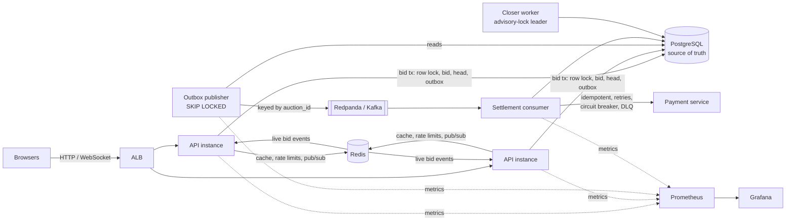

# auction-engine

A real-time auction engine in Go, themed as storage-unit auctions. The theme is cosmetic. The project is about the hard parts of backend systems:
- correctness under heavy contention
- at-least-once messaging made safe with idempotency
- backpressure and graceful degradation
- recovering cleanly when processes are killed mid-operation

The system is defined by its **invariants**, which are enforced by the database schema and explicit mechanisms rather than by hopeful application logic.

## Invariants

| # | Invariant | How it is enforced |
|---|---|---|
| 1 | Exactly one winner per auction, ever | A single closer holds a Postgres advisory lock (leader election). It closes under the same row lock the bid path uses. `status` can only move `open → closed`, enforced by a trigger. |
| 2 | The winner is the highest bidder | Accepted bids form a fork-proof chain (`UNIQUE NULLS NOT DISTINCT (auction_id, prev_bid_id)`). A composite FK ties the auction's leader and price to exactly one real bid. |
| 3 | Every accepted bid beats the previous one by at least `min_increment` | Validated in Go under the row lock, then re-validated by a `BEFORE INSERT` guard trigger. |
| 4 | No bid is accepted after the auction closes | The database clock (`clock_timestamp()`) is read **after** the row lock is acquired, in Go and in the trigger. A measured gotcha shows why: `now()` and a clock read inside the locking `SELECT` can both be stale. |
| 5 | Exactly one charge per closed auction, even under redelivery | Idempotent settlement keyed by invoice, plus idempotency keys at the payment provider. |
| 6 | No bid without its outbox event, and no event without its bid | Written in the same transaction. An FK covers one direction; a deferred constraint trigger fails `COMMIT` for the other. Bids and events are append-only. |
| 7 | All of the above hold while processes are killed | Every state change is one Postgres transaction. The consumers are idempotent. Fault-injection tests kill API instances and workers mid-run, then re-check every invariant. |

An independent **invariant checker** (`internal/invariants`) audits the stored data after tests and load runs. Every check is proven to detect a violation planted for it.

## Architecture



- **Postgres is the single source of truth.** Every invariant lives there.
- **Redis is an accelerator, never a source of truth.** When Redis is slow or down, every Redis-backed feature degrades instead of failing ([ADR 017](docs/decisions/017-redis-as-accelerator.md)).
- **Kafka (Redpanda locally) carries async work.** Events come from a transactional outbox, keyed by `auction_id` for per-auction ordering.

## How a bid works

`POST /auctions/{id}/bids` runs in **one** READ COMMITTED transaction ([ADR 007](docs/decisions/007-bid-path-locking.md)):
1. Check the user exists.
2. `SELECT … FOR UPDATE` on the auction row. Every competing bid now waits here.
3. Look up the idempotency key. This happens *after* the lock, which fixes a race a test caught ([ADR 009](docs/decisions/009-idempotency.md)).
4. Read `clock_timestamp()` in a separate statement.
5. Validate: the bid is inside the window, above the minimum, and the bidder isn't already leading.
6. Insert the bid, advance the auction head, and insert the outbox event.
7. Commit. Then refresh the cache and publish the live event, detached from the request, so a disconnecting client can't suppress them.

The database guard trigger re-checks every rule, so a bug in Go can't corrupt state. It can only be caught ([ADR 008](docs/decisions/008-schema-enforced-invariants.md)).

## Features

- **Pessimistic row locking** is the production strategy. An **optimistic** strategy (optimistic read, conflict detected at write, jittered retries) is kept behind `BID_LOCKING` for benchmarking ([ADR 014](docs/decisions/014-optimistic-bid-strategy.md), [ADR 016](docs/decisions/016-keep-pessimistic-locking.md)).
- **Idempotency keys** on bid creation (replays return the original bid) and on settlement.
- **Transactional outbox:** events are written with the state change. A separate publisher uses `SELECT … FOR UPDATE SKIP LOCKED` and publishes to Kafka keyed by `auction_id`.
- **Settlement:** consumes closed auctions and charges through a deliberately flaky payment service (10% failures, occasional 5s hangs). It uses timeouts, jittered exponential backoff, a circuit breaker and a dead-letter queue, and charges exactly once.
- **Closer and anti-snipe:** a single leader, elected with a Postgres advisory lock, closes auctions under the bid path's row lock. A bid in the final 10 seconds extends `end_at` by 10 seconds.
- **Live updates:**
  - WebSockets, with a Redis pub/sub fan-out across API instances
  - a per-connection buffered channel; slow clients are dropped (1013), never allowed to block a room
  - a snapshot on connect, gap detection through the bid chain, and a periodic sync ([ADR 020](docs/decisions/020-live-updates.md))
- **Rate limiting:** a per-user Redis token bucket in one atomic Lua script, using Redis's clock. It returns 429 with `Retry-After` and fails open ([ADR 018](docs/decisions/018-rate-limiting.md)).
- **Caching:** a version-guarded auction read cache, so a slow reader can never overwrite newer state ([ADR 019](docs/decisions/019-auction-read-cache.md)).
- **Load shedding:** when the system is saturated, new work is refused early instead of queueing without bound.
- **Graceful shutdown:**
  - in-flight requests drain
  - request contexts are cancelled at the drain deadline
  - WebSockets close with 1001
  - the database pool closes last
- **Observability:**
  - Prometheus metrics, with bounded label cardinality
  - a provisioned Grafana dashboard
  - structured JSON logs with request IDs
- **Configuration:** everything comes from environment variables, all required, validated at startup with every error reported at once ([ADR 001](docs/decisions/001-config-from-env.md)).
- **Deployment:**
  - Terraform on AWS: ECS on EC2, RDS, S3, ALB
  - GitHub Actions for tests on every push, and for deployment

## Running it locally

Requirements: Docker (colima works), Go 1.27, `make`.

```sh
cp .env.example .env
make up          # postgres, redis, migrations, two API instances, prometheus, grafana
```

| What | Where |
|---|---|
| Live auction page (deliberately plain) | http://localhost:8080/ |
| Second API instance | http://localhost:8081/ |
| Grafana dashboard (no login needed to view) | http://localhost:3000/ |
| Prometheus | http://localhost:9090/ |

```sh
make help        # every target
make test-race   # all tests with the race detector (needs Docker: integration tests use testcontainers)
make test-page   # the live page's client-contract test (needs Node)
make bench-smoke # a 10s load run that verifies itself
make down        # stop (keeps data); `make nuke` also deletes the database volume
```

## Testing

- **Table-driven unit tests,** plus a **fuzz test** that replays random bid sequences against the rules.
- **Integration tests** run against real Postgres and Redis through **testcontainers**. There are no database mocks: each test gets a fresh database cloned from a migrated template in milliseconds.
- **A 1000-concurrent-bid test** proves there's no lost update. It runs against both locking strategies. **Mutation checks** show that each safety layer (app lock, guard trigger, fork-proof constraint) independently prevents corruption, and that removing all three produces a real lost update, which the test catches.
- **Schema tests** pin every constraint and trigger to its exact SQLSTATE.
- **A self-verifying load generator** (`cmd/loadgen`). A run fails loudly unless:
  - the server counted every response the client received
  - the client's accepted count matches the database
  - prices moved
  - every invariant held

  A stub that returns 201 without storing anything is proven to fail these checks.
- **Fault injection** kills API instances and workers mid-run, then re-checks every invariant.
- **CI** (GitHub Actions) runs lint, `go test -race ./...`, the page contract test, and an image build on every push.

## Benchmarks

Measured on an Apple M3 laptop, in a 4 vCPU / 6 GiB colima VM shared by the API, Postgres and the load generator. Full data, method and caveats are in [`docs/benchmarks.md`](docs/benchmarks.md), with raw JSON committed alongside.

| Scenario (one auction) | Pessimistic | Optimistic |
|---|---|---|
| 10 concurrent bidders: throughput / accepted bids/s / p99 | **4,145 req/s / 1,126 / 3.3 ms** | 3,631 req/s / 919 / 7.0 ms |
| 200 concurrent bidders: throughput / accepted bids/s / p99 | 6,284 req/s / 114 / 45.7 ms | **10,336 req/s / 198 / 40.6 ms** |

- Pessimistic locking wins at moderate contention, because optimistic wastes about 3 attempts per accepted bid.
- Optimistic wins at extreme contention. The *hypothesis* is that it rejects doomed bids without touching the lock; pool queueing confounds that, and the analysis says so.

## Repository layout

```
cmd/            api, migrate (one-shot goose migrations), loadgen
internal/
  auction/      domain rules and the bid path (pessimistic and optimistic)
  httpapi/      router, handlers, middleware, WebSocket endpoint, plain HTML page
  live/         WebSocket hub and the Redis pub/sub bus
  cache/        version-guarded auction cache
  ratelimit/    Redis token bucket
  invariants/   SQL audit of every invariant
  metrics/      Prometheus metrics
  loadgen/      self-verifying load generator
  config/ postgres/ redisclient/ testdb/ testredis/
migrations/     SQL schema, constraints and triggers
deploy/         Prometheus and Grafana provisioning
docs/           decisions/ (ADRs), benchmarks, open questions, interview notes
```

## Design decisions

Every significant decision is written up as a short ADR in [`docs/decisions/`](docs/decisions/), covering context, decision, alternatives considered and consequences. Known risks, and the findings deferred from each milestone's adversarial review, are tracked in [`docs/open-questions.md`](docs/open-questions.md).

## License

[MIT](LICENSE)
